### Họ và Tên: Trần Minh Khang
### MSSV: 2387700027

# BÀI 2: MÃ HOÁ VÀ TRIỂN KHAI HẠ TẦNG KHÓA CÔNG KHAI (PKI)
## BÁO CÁO TỔNG QUAN HỆ THỐNG MẬT MÃ ỨNG DỤNG & MÔ PHỎNG X.509 CA

---

## 1. Giới thiệu tổng quan

Bài thực hành số 2 tập trung vào việc nghiên cứu nguyên lý hoạt động, thiết kế kiến trúc và cài đặt thực tế các cơ chế bảo mật mật mã học hiện đại, bao gồm hai hợp phần độc lập nhưng gắn kết chặt chẽ:

1. **CryptoToolkit (`Bài 2/crypto-toolkit`):** Xây dựng bộ thư viện mã hóa toàn diện gồm mã hóa đối xứng xác thực (AES-256-GCM), hàm sinh khóa mật khẩu (PBKDF2HMAC), mật mã bất đối xứng (RSA 2048-bit), băm mật khẩu thế hệ mới chống tấn công phần cứng (Argon2), cùng đa dạng các kênh giao tiếp: Command Line Interface (CLI), RESTful API (Flask), và giao diện đồ họa Desktop (Tkinter).
2. **Mini-CA (`Bài 2/mini-ca`):** Xây dựng hệ thống cấp phát và quản lý vòng đời chứng chỉ số phân cấp theo chuẩn quốc tế X.509 v3 (gồm Root CA và Intermediate CA), thực hiện ký số và cấp phát chứng chỉ End-entity, thẩm định chuỗi tin cậy (Chain of Trust), quản lý danh sách thu hồi chứng chỉ (Certificate Revocation List - CRL) và mô phỏng giao thức kiểm tra trạng thái trực tuyến (OCSP).

---

## 2. Cấu trúc thư mục Bài 2

```text
Bai2/
├── crypto-toolkit/                     # Hợp phần 1: Thư viện mật mã đa năng
│   ├── files/
│   │   ├── data.txt                    # Tệp tin văn bản gốc
│   │   ├── data.txt.enc                # Tệp tin sau khi mã hóa AES-GCM
│   │   └── data.txt.dec                # Tệp tin sau khi giải mã
│   ├── securecrypto/
│   │   ├── __init__.py                 # Khởi tạo gói thư viện v0.1.0
│   │   ├── aes_utils.py                # KDF (PBKDF2) & Mã hóa/giải mã AES-256-GCM
│   │   ├── hash_utils.py               # Băm mật khẩu an toàn với Argon2
│   │   ├── rsa_utils.py                # Sinh cặp khóa RSA & Ký số/Xác thực chữ ký
│   │   ├── cli.py                      # Giao diện dòng lệnh CLI (argparse)
│   │   ├── api.py                      # RESTful API Service (Flask)
│   │   └── app_gui.py                  # Giao diện Desktop GUI (Tkinter)
│   ├── tests/
│   │   ├── test_aes_utils.py           # Unit test cho module AES
│   │   ├── test_hash_utils.py          # Unit test cho module Argon2
│   │   └── test_rsa_utils.py           # Unit test cho module RSA
│   ├── requirements.txt                # Thư viện phụ thuộc kiểm thử
│   ├── setup.py                        # Cấu hình cài đặt package 'securecrypto'
│   └── README.md                       # Báo cáo kỹ thuật chi tiết CryptoToolkit
├── mini-ca/                            # Hợp phần 2: Hệ thống phân cấp CA & X.509
│   ├── ca_utils.py                     # Quản lý khóa, tạo Root/Intermediate CA, cấp chứng chỉ
│   ├── revoke_utils.py                 # Xây dựng CRL, thu hồi và kiểm tra trạng thái OCSP
│   ├── demo.py                         # Kịch bản thực thi tự động toàn bộ vòng đời CA
│   ├── demo_ui.py                      # Ứng dụng Desktop trực quan hóa vòng đời CA
│   ├── requirements.txt                # Thư viện phụ thuộc cho Mini-CA
│   └── README.md                       # Báo cáo kỹ thuật chi tiết Mini-CA
└── images/                             # Thư mục lưu trữ hình ảnh minh chứng thực nghiệm
    ├── 01_unit_tests.png               # Kết quả chạy 6/6 Unit Tests
    ├── 02_cli_encrypt_decrypt.png      # Kết quả mã hóa & giải mã qua CLI
    ├── 03_crypto_gui.png               # Kết quả thực thi giao diện Desktop Crypto GUI
    ├── 04_api_encrypt.png              # Kết quả gọi API /encrypt trên Postman
    ├── 05_api_decrypt.png              # Kết quả gọi API /decrypt trên Postman
    ├── 06_ca_demo_cli.png              # Kết quả chạy script tự động demo.py của Mini-CA
    ├── 07_ca_certs_folder.png          # Danh sách tệp tin chứng chỉ trong thư mục certs/
    ├── 08_ca_demo_ui.png               # Kết quả chạy ứng dụng giao diện Mini CA Demo UI
    ├── notepad_plaintext.png           # Mở tệp gốc data.txt trên Notepad
    ├── notepad_encrypted.png           # Mở tệp mã hóa data.txt.enc trên Notepad
    └── notepad_decrypted.png           # Mở tệp giải mã data.txt.dec trên Notepad
```

---

## 3. Bảng tổng hợp thuật toán & Công nghệ sử dụng

| Phân hệ | Nhiệm vụ kỹ thuật | Thuật toán / Tiêu chuẩn | Thư viện triển khai | Đặc tính bảo mật cốt lõi |
|---|---|---|---|---|
| **CryptoToolkit** | Sinh khóa từ mật khẩu (KDF) | **PBKDF2HMAC-SHA256** (100,000 vòng) | `cryptography.hazmat` | Sử dụng Salt ngẫu nhiên 16 bytes chống tấn công Rainbow Table, làm chậm brute-force. |
| **CryptoToolkit** | Mã hóa tệp tin | **AES-256-GCM** (Galois/Counter Mode) | `cryptography.hazmat` | Mã hóa đối xứng xác thực (AEAD), chống can thiệp ciphertext và bảo vệ toàn vẹn bằng Authentication Tag. |
| **CryptoToolkit** | Băm mật khẩu người dùng | **Argon2** (Argon2id) | `argon2-cffi` | Quán quân giải thưởng Password Hashing Competition; chống tấn công phần cứng GPU/ASIC bằng Memory-hard. |
| **CryptoToolkit** | Ký số và xác thực chữ ký | **RSA 2048-bit + PKCS#1 v1.5** | `cryptography.hazmat` | Khóa công khai / bí mật theo chuẩn RSA, băm thông điệp qua SHA-256 trước khi ký. |
| **Mini-CA** | Cấu trúc chứng chỉ số | **X.509 Version 3** | `cryptography.x509` | Hỗ trợ mở rộng `BasicConstraints`, định danh `NameOID`, số serial ngẫu nhiên, thời hạn hiệu lực rõ ràng. |
| **Mini-CA** | Quản lý thu hồi chứng chỉ | **CRL (X.509 CRL v2)** | `cryptography.x509` | Danh sách thu hồi có chữ ký điện tử của CA, lưu trữ serial bị vô hiệu kèm lý do `key_compromise`. |
| **Mini-CA** | Trực quan hóa & Tương tác | **Tkinter & Flask** | `tkinter`, `flask` | Giao diện đồ họa đa nền tảng và cổng API chuẩn RESTful cho tích hợp hệ thống phân tán. |

---

## 4. Hướng dẫn cài đặt và thiết lập nhanh

### 4.1. Chuẩn bị môi trường
Yêu cầu hệ điều hành Windows, Linux hoặc macOS đã cài đặt Python 3.10+:

```bash
# Di chuyển vào thư mục bài tập
cd "Bài 2/crypto-toolkit"

# Cài đặt gói thư viện securecrypto ở chế độ phát triển (Editable mode)
pip install -e .

# Cài đặt các phụ thuộc kiểm thử
pip install -r requirements.txt

# Di chuyển sang thư mục Mini-CA và cài đặt phụ thuộc
cd "../mini-ca"
pip install -r requirements.txt
```

---

## 5. Danh mục hình ảnh thực nghiệm (Output Screenshots)

Dưới đây là các vị trí hình ảnh minh chứng cho từng bước thực nghiệm của Bài 2:

### 5.1. Kết quả kiểm thử Unit Tests (CryptoToolkit)
* **Mô tả:** Chạy toàn bộ 6 test cases trong thư mục `tests/` kiểm tra tính chính xác của thuật toán AES, Argon2 và RSA.
* **Đường dẫn ảnh:** `images/01_unit_tests.png`

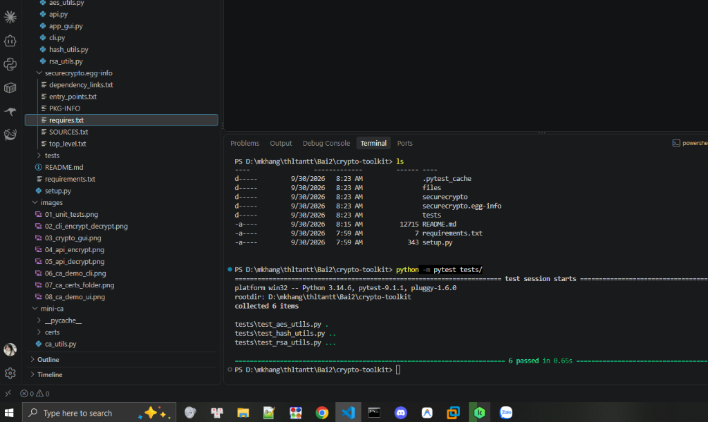

---

### 5.2. Kết quả mã hóa và giải mã qua CLI
* **Mô tả:** Thực hiện lệnh mã hóa file `data.txt` ra `data.txt.enc` với mật khẩu, sau đó giải mã về `data.txt.dec` và đối soát nội dung gốc `HUTECH University`.
* **Đường dẫn ảnh:** `images/02_cli_encrypt_decrypt.png`

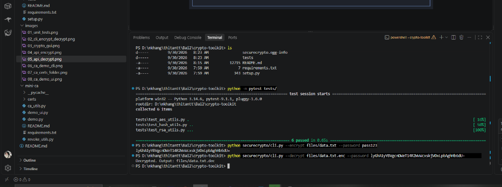

#### Kiểm tra trực quan trên Notepad (Bản rõ vs Đã mã hóa vs Giải mã):
Minh chứng đối soát nội dung tệp tin qua 3 giai đoạn khi mở bằng phần mềm Notepad:

| 1. Bản rõ gốc (`data.txt`) | 2. Dữ liệu đã mã hóa (`data.txt.enc`) | 3. Dữ liệu giải mã (`data.txt.dec`) |
|:---:|:---:|:---:|
| 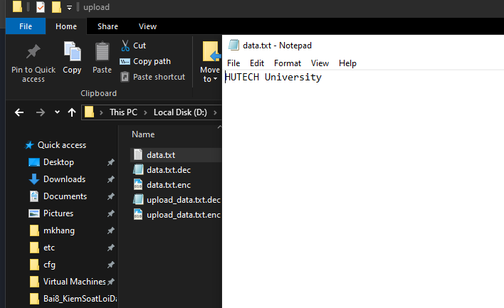 | 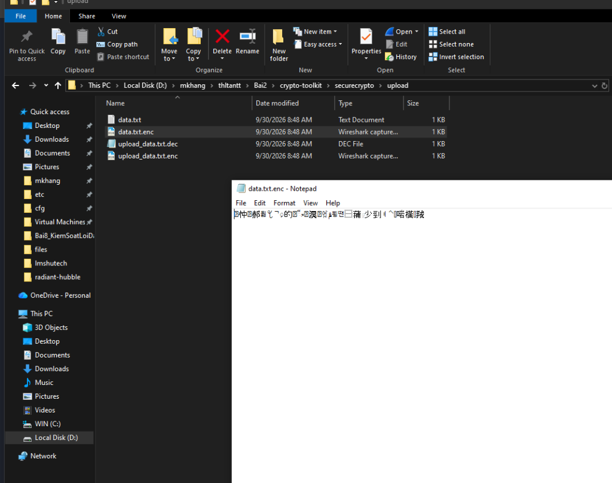 | 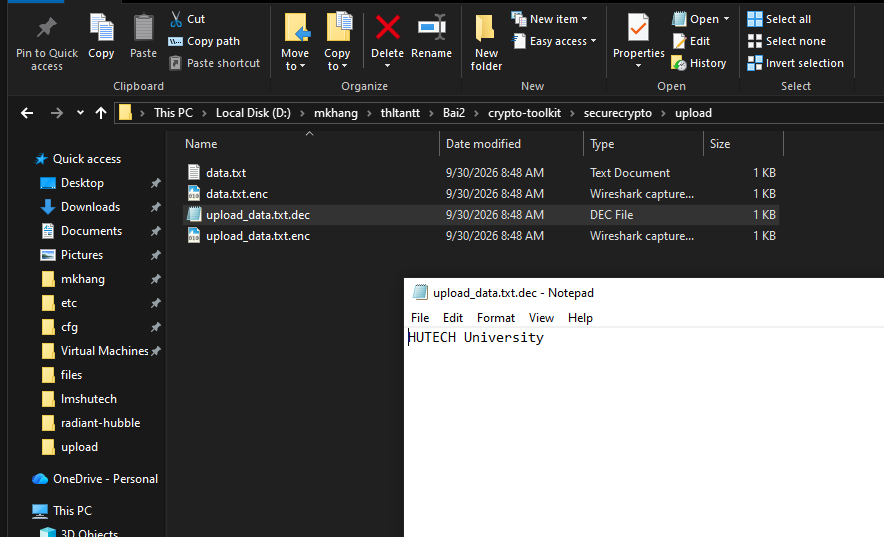 |
| *Bản rõ ban đầu: `HUTECH University`* | *Ciphertext nhị phân không thể đọc được* | *Khôi phục 100% nguyên vẹn bản rõ ban đầu* |

---

### 5.3. Giao diện Desktop GUI (CryptoToolkit)
* **Mô tả:** Cửa sổ đồ họa Tkinter nhập mật khẩu, thao tác chọn file để Encrypt và Decrypt trực quan.
* **Đường dẫn ảnh:** `images/03_crypto_gui.png`

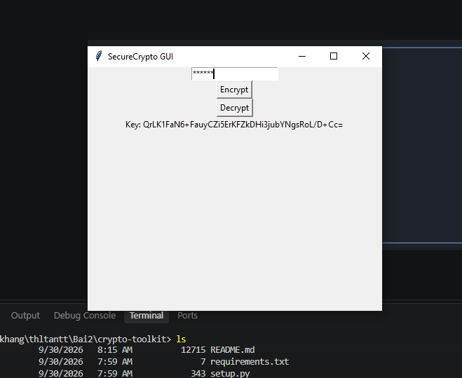

---

### 5.4. Kiểm thử RESTful API trên Postman (/encrypt & /decrypt)
* **Mô tả:** Gửi yêu cầu HTTP POST `multipart/form-data` tới endpoint `/encrypt` và `/decrypt` của Flask API.
* **Đường dẫn ảnh:** `images/04_api_encrypt.png` và `images/05_api_decrypt.png`

| API /encrypt | API /decrypt |
|:---:|:---:|
| 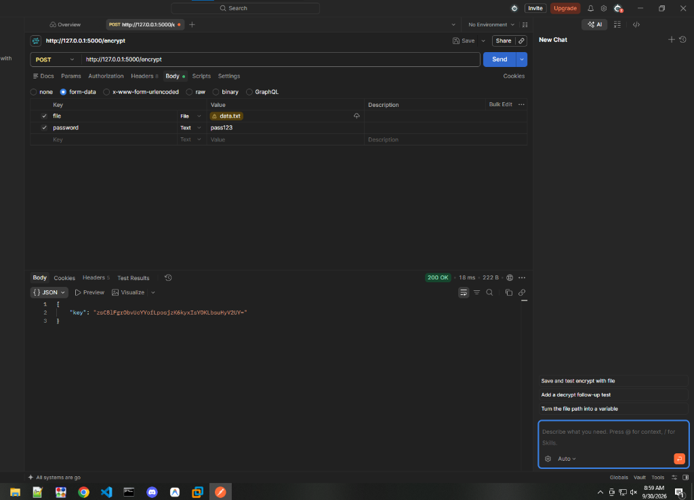 | 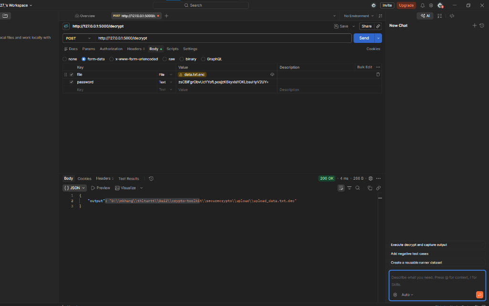 |

---

### 5.5. Chạy kịch bản tự động vòng đời CA (`demo.py`)
* **Mô tả:** Terminal chạy kịch bản hoàn chỉnh tạo Root CA, Intermediate CA, cấp chứng chỉ End-entity, kiểm tra chuỗi, thu hồi chứng chỉ và kiểm tra trạng thái OCSP.
* **Đường dẫn ảnh:** `images/06_ca_demo_cli.png`

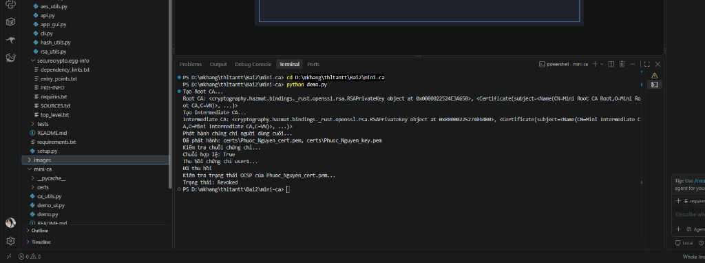

---

### 5.6. Danh sách tệp tin chứng chỉ trong thư mục `certs/`
* **Mô tả:** Cấu trúc tệp tin PEM được tạo tự động bao gồm khóa bí mật, chứng chỉ X.509 và file danh sách thu hồi `ca_crl.pem`.
* **Đường dẫn ảnh:** `images/07_ca_certs_folder.png`

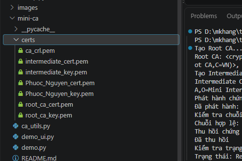

---

### 5.7. Giao diện Desktop trực quan hóa Mini-CA (`demo_ui.py`)
* **Mô tả:** Ứng dụng Tkinter cho phép tương tác từng bước qua 5 nút chức năng của hệ thống CA kèm hộp hiển thị nhật ký và thông báo trạng thái.
* **Đường dẫn ảnh:** `images/08_ca_demo_ui.png`

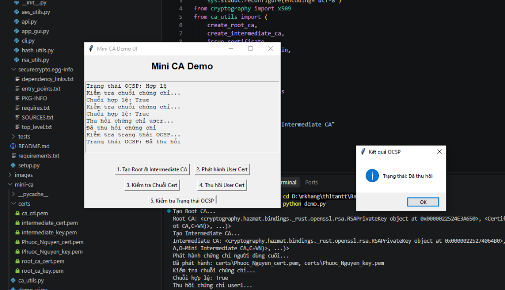

---

## 6. Liên kết báo cáo kỹ thuật chuyên sâu

* 👉 **Xem chi tiết Hợp phần 1:** [Báo cáo kỹ thuật CryptoToolkit](crypto-toolkit/README.md)
* 👉 **Xem chi tiết Hợp phần 2:** [Báo cáo kỹ thuật Mini-CA (PKI & X.509)](mini-ca/README.md)
