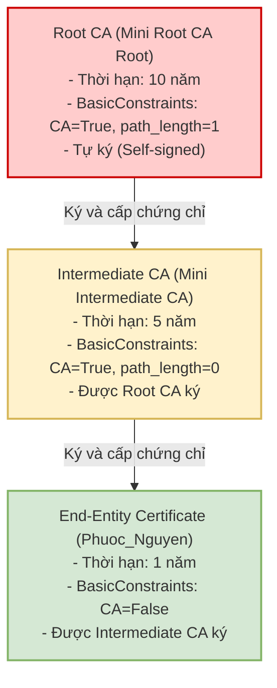

### Họ và Tên: Trần Minh Khang
### MSSV: 2387700027

# BÁO CÁO KỸ THUẬT: MINI-CA (PKI & X.509)
## THIẾT KẾ HẠ TẦNG KHÓA CÔNG KHAI, VÒNG ĐỜI CHỨNG CHỈ & CƠ CHẾ THU HỒI CRL/OCSP

---

## 1. Giới thiệu và Kiến trúc Hạ tầng PKI

Phân hệ `mini-ca` mô phỏng một hệ thống Hạ tầng Khóa Công khai (Public Key Infrastructure - PKI) hoàn chỉnh theo tiêu chuẩn quốc tế **ITU-T X.509 v3 / RFC 5280**, cho phép quản lý toàn bộ vòng đời của chứng chỉ số từ khởi tạo, phát hành, xác thực chuỗi đến thu hồi:

```text
mini-ca/
├── certs/                     # Thư mục chứa các tệp khóa bí mật và chứng chỉ PEM (được .gitignore bảo vệ)
│   ├── root_ca_key.pem        # Khóa riêng tư của Root CA
│   ├── root_ca_cert.pem       # Chứng chỉ tự ký của Root CA
│   ├── intermediate_key.pem   # Khóa riêng tư của Intermediate CA
│   ├── intermediate_cert.pem  # Chứng chỉ của Intermediate CA do Root CA ký
│   ├── Phuoc_Nguyen_key.pem   # Khóa riêng tư của End-entity (người dùng cuối)
│   ├── Phuoc_Nguyen_cert.pem  # Chứng chỉ End-entity do Intermediate CA ký
│   └── ca_crl.pem             # Danh sách thu hồi chứng chỉ (CRL) có chữ ký số
├── ca_utils.py                # Quản lý khóa, xây dựng cấu trúc X.509 và thẩm định chuỗi tin cậy
├── revoke_utils.py            # Quản lý danh sách thu hồi CRL và mô phỏng giao thức kiểm tra OCSP
├── demo.py                    # Kịch bản thực thi tự động toàn bộ quy trình trên console
├── demo_ui.py                 # Ứng dụng Desktop trực quan hóa 5 bước vòng đời chứng chỉ
├── requirements.txt           # Danh sách gói phụ thuộc (cryptography)
└── README.md                  # Báo cáo kỹ thuật chi tiết Mini-CA
```

---

## 2. Kiến trúc phân cấp và Chuỗi tin cậy (Chain of Trust)

Mô hình triển khai phân cấp 2 tầng được thiết kế nhằm bảo vệ khóa gốc và phân định quyền hạn rõ ràng:



---

## 3. Phân tích chi tiết các Module mã nguồn

### 3.1. Module `ca_utils.py` — Khởi tạo và Quản lý Chứng chỉ số

#### a. Root CA (`create_root_ca`):
* **Cơ chế tự ký (Self-signed):** Subject và Issuer hoàn toàn trùng khớp nhau (`subject = issuer`).
* **BasicConstraints:** Thiết lập `ca=True` và `path_length=1`. Thuộc tính `path_length=1` mang ý nghĩa bảo mật tối quan trọng: Root CA chỉ cho phép tạo ra tối đa **1 cấp** CA trung gian bên dưới nó, ngăn ngừa việc các CA con tự ý nhân bản thêm nhiều cấp CA không thể kiểm soát.
* **Thời hạn hiệu lực:** 10 năm (3,650 ngày).

#### b. Intermediate CA (`create_intermediate_ca`):
* **Ủy quyền tin cậy:** Issuer được gán bằng `root_cert.subject` và toàn bộ chứng chỉ được ký điện tử bằng khóa bí mật của Root CA (`root_key`).
* **BasicConstraints:** Thiết lập `ca=True` và `path_length=0`. Điều này chỉ định rõ Intermediate CA này có quyền cấp phát chứng chỉ cho người dùng cuối nhưng **không có quyền** tạo thêm bất kỳ Sub-CA nào khác.
* **Thời hạn hiệu lực:** 5 năm (1,825 ngày).

#### c. Chứng chỉ người dùng cuối End-entity (`issue_certificate`):
* **Định danh chủ thể (Subject):** Chứa thông tin quốc gia (`C=VN`), tổ chức (`O=PHUOCNTMH Company`), và tên miền/chủ thể (`CN=Phuoc_Nguyen`).
* **BasicConstraints:** Thiết lập bắt buộc `ca=False, path_length=None`. Đảm bảo chứng chỉ này chỉ dùng để mã hóa hoặc xác thực danh tính, tuyệt đối không thể ký cấp chứng chỉ cho bất kỳ thực thể nào khác.
* **Thời hạn hiệu lực:** 1 năm (365 ngày).

#### d. Thẩm định chuỗi chứng chỉ (`verify_certificate_chain`):
```python
def verify_certificate_chain(cert_to_verify, chain):
    try:
        for issuer_cert in chain:
            issuer_public_key = issuer_cert.public_key()
            issuer_public_key.verify(
                cert_to_verify.signature,
                cert_to_verify.tbs_certificate_bytes,
                padding.PKCS1v15(),
                cert_to_verify.signature_hash_algorithm,
            )
            cert_to_verify = issuer_cert
        return True
    except Exception as e:
        print("Verification failed:", e)
        return False
```
* Hàm thẩm định đệ quy ngược từ chứng chỉ người dùng (`cert_to_verify`) lên chứng chỉ trung gian và chứng chỉ gốc trong `chain`.
* Đối soát chữ ký số bằng cách lấy khóa công khai của thực thể cấp (`issuer_public_key`) để giải mã chữ ký và so sánh với giá trị băm của khối dữ liệu `tbs_certificate_bytes` (To-Be-Signed Certificate).

---

### 3.2. Module `revoke_utils.py` — Quản lý Thu hồi Chứng chỉ (CRL & OCSP)

#### a. Danh sách thu hồi chứng chỉ (CRL - Certificate Revocation List):
* Khi một chứng chỉ bị rò rỉ khóa bí mật (`x509.ReasonFlags.key_compromise`), CA đưa số serial của chứng chỉ đó vào danh sách đen `ca_crl.pem`.
* Mỗi bản ghi thu hồi chứa `serial_number`, `revocation_date` và phần mở rộng lý do `CRLReason`.
* Toàn bộ danh sách CRL được ký bởi khóa bí mật của Intermediate CA, kèm theo mốc thời gian cập nhật hiện tại (`last_update`) và thời điểm bắt buộc phải cập nhật bản mới (`next_update` sau 7 ngày).

#### b. Mô phỏng kiểm tra trực tuyến (OCSP):
* Hàm `check_revocation_status(cert_file)` đóng vai trò là một OCSP Responder: nhận vào chứng chỉ cần kiểm tra, trích xuất `serial_number` và tra cứu thời gian thực trong danh sách thu hồi. Nếu phát hiện serial nằm trong danh sách, hàm trả về `True` (Revoked), ngược lại trả về `False` (Valid).

---

## 4. Ứng dụng Desktop Trực quan hóa (`demo_ui.py`)

Giao diện được phát triển bằng `tkinter` tích hợp khung nhật ký theo dõi chi tiết và 5 nút điều khiển tương ứng với toàn bộ vòng đời của chứng chỉ:

```text
+---------------------------------------------------------------+
|                      Mini CA Demo UI                          |
+---------------------------------------------------------------+
|  [Khung hiển thị Nhật ký tiến trình - Terminal Event Logger]  |
|  > Tạo Root CA thành công                                     |
|  > Tạo Intermediate CA thành công                             |
|  > Phát hành chứng chỉ Phuoc_Nguyen_cert.pem                  |
|  > Kiểm tra chuỗi chứng chỉ: Hợp lệ                           |
|  > Đã thu hồi chứng chỉ Phuoc_Nguyen (Lý do: Key Compromise)  |
|  > Kiểm tra trạng thái OCSP: Đã thu hồi                       |
+---------------------------------------------------------------+
| [1. Tạo Root & Intermediate CA]   [2. Phát hành User Cert]    |
| [3. Kiểm tra Chuỗi Cert]          [4. Thu hồi User Cert]      |
|              [5. Kiểm tra Trạng thái OCSP]                    |
+---------------------------------------------------------------+
```

---

## 5. Kết quả thực nghiệm (Output Minh chứng)

### 5.1. Kịch bản chạy tự động trên dòng lệnh (`demo.py`)
Lệnh thực thi:
```bash
python demo.py
```
Output:
```text
Tạo Root CA...
Root CA: <RSAPrivateKey>, <Certificate(CN=Mini Root CA Root)>
Tạo Intermediate CA...
Intermediate CA: <RSAPrivateKey>, <Certificate(CN=Mini Intermediate CA)>
Phát hành chứng chỉ người dùng cuối...
Đã phát hành: certs\Phuoc_Nguyen_cert.pem, certs\Phuoc_Nguyen_key.pem
Kiểm tra chuỗi chứng chỉ...
Chuỗi hợp lệ: True
Thu hồi chứng chỉ user1...
Đã thu hồi
Kiểm tra trạng thái OCSP của Phuoc_Nguyen_cert.pem...
Trạng thái: Revoked
```


---

### 5.2. Danh mục tệp tin chứng chỉ trong thư mục `certs/`
Thư mục `certs/` sau khi thực thi chứa đầy đủ các chứng chỉ và cặp khóa định dạng PEM theo đúng đặc tả:
* `root_ca_cert.pem` / `root_ca_key.pem`
* `intermediate_cert.pem` / `intermediate_key.pem`
* `Phuoc_Nguyen_cert.pem` / `Phuoc_Nguyen_key.pem`
* `ca_crl.pem`


---

### 5.3. Giao diện Desktop trực quan hóa Mini CA (`demo_ui.py`)
Lệnh khởi chạy:
```bash
python demo_ui.py
```


---

## 6. Phân tích bảo mật chuyên sâu về Hạ tầng PKI

1. **Ý nghĩa sống còn của mô hình Root CA ngắt mạng (Air-Gapped Root CA):**  
   Trong các hệ thống thực tế, nếu Root CA bị lộ khóa bí mật, toàn bộ hệ sinh thái số (hàng triệu chứng chỉ của máy chủ, người dùng, giao dịch ngân hàng) sẽ lập tức sụp đổ vì không có cơ chế nào có thể thu hồi được chính Root CA ngoài việc phát hành bản cập nhật hệ điều hành để loại bỏ nó khỏi Trusted Root Store. Do đó, Root CA thực tế chỉ được bật lên một lần trong vài năm để ký cho Intermediate CA, sau đó khóa bí mật được lưu trữ trong thiết bị phần cứng HSM (Hardware Security Module) cất giữ trong két sắt ngắt hoàn toàn kết nối mạng (Air-gapped). Toàn bộ hoạt động cấp phát hàng ngày được ủy quyền cho Intermediate CA.
2. **So sánh cơ chế thu hồi CRL vs OCSP:**
   * **CRL:** Hoạt động theo cơ chế ngoại tuyến. Trình duyệt phải tải về một tệp CRL chứa toàn bộ danh sách các chứng chỉ bị thu hồi. Điểm yếu là tệp CRL có thể phình to hàng chục Megabytes gây chậm trễ mạng, và có độ trễ cập nhật (caching latency) khiến chứng chỉ đã bị đánh cắp vẫn có thể được chấp thuận trong khoảng thời gian trước khi bản CRL mới được công bố.
   * **OCSP (Online Certificate Status Protocol):** Truy vấn trực tiếp trạng thái của một chứng chỉ cụ thể theo thời gian thực (Real-time). Để tối ưu hiệu năng và bảo vệ quyền riêng tư người dùng, các máy chủ hiện đại sử dụng kỹ thuật **OCSP Stapling** (máy chủ web định kỳ lấy phản hồi OCSP đã được CA ký và gửi kèm cho trình duyệt trong quá trình TLS Handshake).
