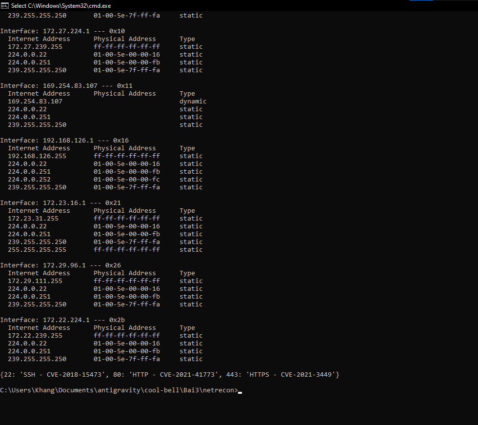
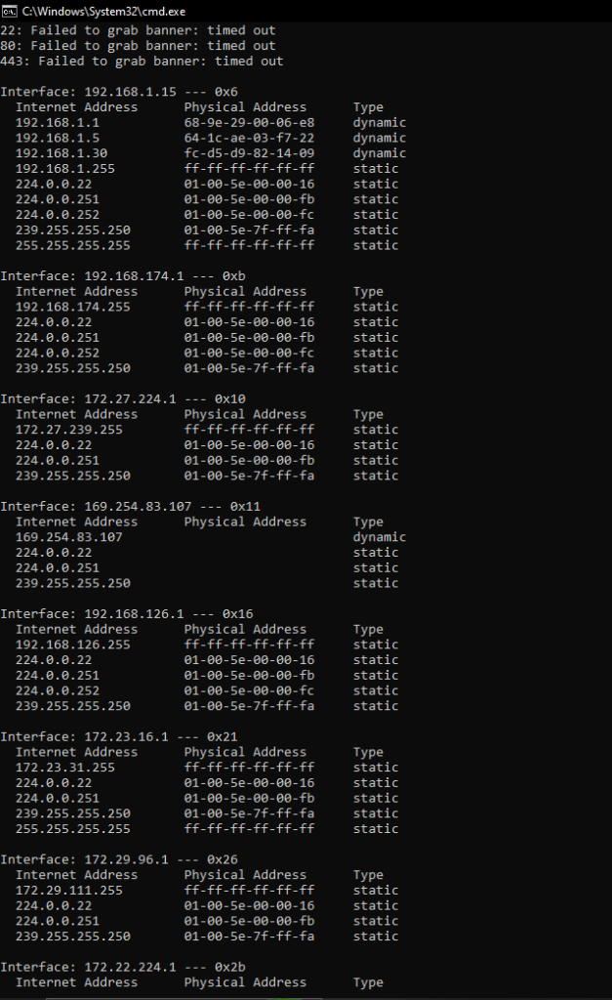
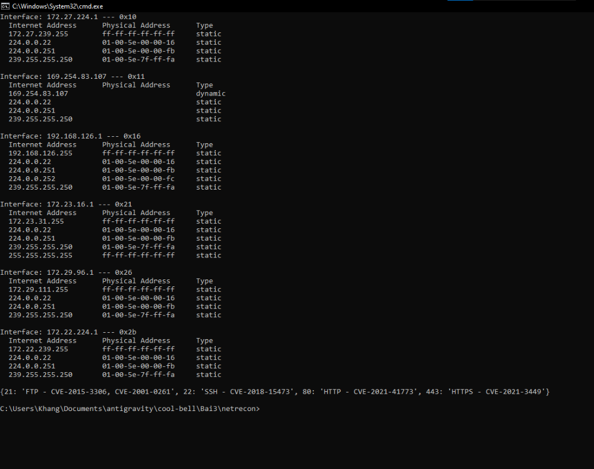

### Họ và Tên: Trần Minh Khang
### MSSV: 2387700027

# BÀI 3: BẢO MẬT MẠNG MÁY TÍNH
## BÁO CÁO TỔNG QUAN LẬP TRÌNH SOCKET AN TOÀN (SSL/TLS) & CÔNG CỤ TRINH SÁT MẠNG (NETRECON)

---

## 1. Giới thiệu tổng quan

Bài thực hành số 3 tập trung vào việc thiết kế và triển khai các giải pháp bảo mật tầng giao vận (Transport Layer Security) và xây dựng bộ công cụ phân tích, trinh sát an ninh mạng chủ động, bao gồm hai hợp phần thực hành trọng tâm:

1. **SecureChat (`Bai3/secure-chat`):** Xây dựng hệ thống chat клиент-server đa luồng tích hợp kênh truyền bảo mật **Mutual SSL/TLS 1.2+** (xác thực chứng chỉ số X.509 hai chiều giữa Server và Client thông qua Root CA nội bộ), kết hợp lớp mã hóa thông điệp đầu-cuối **AES-256-CBC** (kèm đệm PKCS7 và Vector khởi tạo IV ngẫu nhiên 16 bytes), quản lý trạng thái kết nối đồng bộ (`ConnectionManager`) và phân tách phòng chat (`RoomManager`).
2. **NetRecon (`Bai3/netrecon`):** Phát triển bộ công cụ khám phá và kiểm toán mạng đa năng bao gồm: quét cổng TCP bất đồng bộ có kiểm soát tốc độ (`PortScanner` với `asyncio.Semaphore`), nhận dạng phiên bản dịch vụ (`ServiceDetector` tích hợp `nmap -sV`), thu thập thông tin định danh dịch vụ (`BannerGrabber`), khám phá sơ đồ mạng LAN (`NetworkMapper` qua bảng ARP), đối chiếu lỗ hổng bảo mật đã biết (`VulnChecker` theo danh mục CVE), lọc mục tiêu (`whitelist`/`blacklist`), ghi nhật ký thời gian thực và tự động gửi báo cáo qua Gmail SMTP SSL (`cli.py` & Flask Web App `app.py`).

---

## 2. Cấu trúc thư mục Bài 3

```text
Bai3/
├── secure-chat/                        # Hợp phần 1: Ứng dụng Chat bảo mật SSL/TLS & AES-256
│   ├── certs/                          # Thư mục lưu trữ chứng chỉ số X.509 (được .gitignore bảo vệ)
│   │   ├── ca/                         # Chứng chỉ và khóa riêng tư của Root CA (ca.crt, ca.key)
│   │   ├── server/                     # Chứng chỉ, CSR và khóa riêng tư của Server
│   │   └── client/                     # Chứng chỉ, CSR và khóa riêng tư của Client
│   ├── openssl.cnf                     # Cấu hình OpenSSL tạo Root CA (x509_extensions = v3_ca)
│   ├── make-certs.bat                  # Script tự động sinh khóa RSA 2048-bit và ký chứng chỉ
│   ├── message_encryption.py           # Mã hóa/giải mã tin nhắn với AES-256-CBC & PKCS7 Padding
│   ├── connection_manager.py           # Quản lý danh sách kết nối và khóa phiên Thread-safe
│   ├── room_manager.py                 # Quản lý đa phòng chat và phát tán tin nhắn theo phòng
│   ├── server.py                       # Server đa luồng hỗ trợ TLS 1.2+ và xác thực CERT_REQUIRED
│   ├── client.py                       # Client xác minh chứng chỉ Server và trao đổi khóa AES
│   └── README.md                       # Báo cáo kỹ thuật chi tiết SecureChat
├── netrecon/                           # Hợp phần 2: Bộ công cụ trinh sát và kiểm toán mạng
│   ├── modules/
│   │   ├── __init__.py                 # Khởi tạo package modules
│   │   ├── port_scanner.py             # Quét cổng TCP bất đồng bộ với Asyncio Semaphore
│   │   ├── service_detector.py         # Nhận dạng phiên bản dịch vụ qua Nmap (-sV)
│   │   ├── banner_grabber.py           # Thu thập Banner dịch vụ an toàn (timeout 2s)
│   │   ├── network_mapper.py           # Khám phá sơ đồ mạng nội bộ qua bảng ARP (arp -a)
│   │   ├── vuln_checker.py             # Đối chiếu cổng dịch vụ với cơ sở dữ liệu lỗ hổng CVE
│   │   ├── filter_utils.py             # Bộ lọc địa chỉ IP mục tiêu theo Whitelist / Blacklist
│   │   └── email_sender.py             # Gửi báo cáo kết quả quét qua SMTP_SSL (Gmail port 465)
│   ├── static/
│   │   └── style.css                   # Giao diện Dark Mode (Monospace terminal theme)
│   ├── templates/
│   │   ├── layout.html                 # Khung giao diện chuẩn của hệ thống NetRecon
│   │   ├── index.html                  # Biểu mẫu cấu hình quét mạng (ích hợp HTMX)
│   │   └── result.html                 # Trang hiển thị chi tiết kết quả trinh sát mạng
│   ├── cli.py                          # Giao diện dòng lệnh CLI (Click framework)
│   ├── app.py                          # Ứng dụng Web Dashboard (Flask framework)
│   ├── requirements.txt                # Danh sách gói phụ thuộc Python
│   └── README.md                       # Báo cáo kỹ thuật chi tiết NetRecon
└── images/                             # Thư mục lưu trữ hình ảnh minh chứng thực nghiệm
    ├── 01_make_certs.png               # Kết quả chạy make-certs.bat tạo bộ chứng chỉ số
    ├── 02_certs_folder.png             # Cấu trúc thư mục certs/ sau khi khởi tạo
    ├── 03_securechat_1client.png       # Kiểm thử kết nối giữa Server và 1 Client
    ├── 04_securechat_2clients.png      # Kiểm thử phòng chat bảo mật giữa Server và 2 Clients
    ├── 05_netrecon_cli_all.png         # Kết quả chạy cli.py với chế độ toàn diện (all)
    ├── 06_netrecon_cli_modes.png       # Kết quả test nhanh cli.py trên các mục tiêu và chế độ
    ├── 07_netrecon_web_form.png        # Giao diện Web NetRecon tại http://localhost:5000/
    ├── 08_netrecon_web_result.png      # Kết quả phản hồi trinh sát hiển thị trên trình duyệt
    └── 09_netrecon_email.png           # Email báo cáo kết quả quét nhận được từ hệ thống
```

---

## 3. Bảng tổng hợp Kỹ thuật & Công nghệ sử dụng

| Phân hệ | Thành phần | Kỹ thuật / Giao thức | Công cụ / Thư viện | Đặc tính an ninh cốt lõi |
|---|---|---|---|---|
| **SecureChat** | Hạ tầng PKI & Chứng chỉ | **X.509 v3 + RSA 2048-bit (SHA-256)** | `OpenSSL` (`openssl.cnf`) | Tự động hóa phát hành Root CA, Server Cert (`CN=localhost`) và Client Cert (`CN=client`). |
| **SecureChat** | Bảo mật kênh truyền | **Mutual TLS 1.2+ (`CERT_REQUIRED`)** | `ssl`, `socket` | Vô hiệu hóa TLSv1.0/1.1; bắt buộc xác thực chứng chỉ hai chiều chống tấn công MITM. |
| **SecureChat** | Mã hóa thông điệp | **AES-256-CBC + PKCS7 Padding** | `cryptography.hazmat` | Khóa phiên 256-bit sinh ngẫu nhiên mỗi phiên kết nối kèm IV 16 bytes độc lập cho từng bản tin. |
| **SecureChat** | Quản lý đồng thời | **Multi-threading + Mutex Lock** | `threading.Lock` | Bảo vệ cấu trúc dữ liệu `clients` và `rooms` khỏi Race Condition khi nhiều luồng truy cập. |
| **NetRecon** | Quét cổng tốc độ cao | **Async TCP Connect + Rate Limiting** | `asyncio.Semaphore` | Kiểm soát số lượng kết nối đồng thời (`rate_limit=100`), tránh gây quá tải mục tiêu. |
| **NetRecon** | Nhận dạng dịch vụ & Banner | **Active Service Fingerprinting** | `nmap -sV`, `socket` | Phân tích chữ ký giao thức phản hồi và thu thập Banner với cơ chế ngắt `timeout=2s`. |
| **NetRecon** | Khám phá mạng & Lỗ hổng | **ARP Mapping & CVE Lookup** | `arp -a`, `vuln_checker` | Lập sơ đồ ánh xạ IP-MAC nội bộ và cảnh báo sớm các CVE nghiêm trọng trên các cổng nhạy cảm. |
| **NetRecon** | Giao diện & Cảnh báo | **CLI, Flask Web UI & SMTP SSL** | `click`, `flask`, `smtplib` | Đa kênh tương tác, ghi nhật ký `netrecon.log` kèm dấu thời gian và gửi báo cáo qua cổng 465. |

---

## 4. Hướng dẫn cài đặt và thiết lập nhanh

### 4.1. Khởi chạy SecureChat (`Bai3/secure-chat`)
```bash
# 1. Di chuyển vào thư mục secure-chat
cd Bai3/secure-chat

# 2. Sinh chứng chỉ số CA, Server và Client bằng OpenSSL
.\make-certs.bat

# 3. Khởi động SecureChat Server (Terminal 1)
python server.py

# 4. Khởi động các SecureChat Client (Terminal 2, Terminal 3)
python client.py
```

### 4.2. Khởi chạy NetRecon (`Bai3/netrecon`)
```bash
# 1. Di chuyển vào thư mục netrecon và cài đặt phụ thuộc
cd Bai3/netrecon
pip install -r requirements.txt

# 2. Cấu hình thông tin Gmail App Password trong file .env
# SMTP_USER=your_email@gmail.com
# SMTP_PASS=your_app_password

# 3. Chạy công cụ qua giao diện dòng lệnh (CLI)
python cli.py --target scanme.nmap.org --ports 22,80 --mode scan
python cli.py --target 127.0.0.1 --ports 22,80,443 --mode all

# 4. Hoặc khởi chạy giao diện Web tại http://localhost:5000/
python app.py
```

---

## 5. Danh mục hình ảnh thực nghiệm (Output Screenshots)

Dưới đây là các hình ảnh minh chứng cho từng bước thực nghiệm của Bài 3:

### 5.1. Tạo chứng chỉ số với `make-certs.bat` (SecureChat)
* **Mô tả:** Thực thi script `.\make-certs.bat` sử dụng OpenSSL để sinh khóa và ký chứng chỉ cho CA, Server và Client.
* **Đường dẫn ảnh:** `images/01_make_certs.png`


---

### 5.2. Cấu trúc thư mục `certs/` sau khi khởi tạo
* **Mô tả:** Kiểm tra các tệp chứng chỉ (`.crt`), yêu cầu ký chứng chỉ (`.csr`) và khóa riêng tư (`.key`) được tạo trong `certs/ca`, `certs/server` và `certs/client`.
* **Đường dẫn ảnh:** `images/02_certs_folder.png`


---

### 5.3. Kiểm thử kết nối giữa Server và 1 Client (SecureChat)
* **Mô tả:** Chạy `server.py` lắng nghe trên cổng `8443` và 1 `client.py` kết nối xác thực chứng chỉ SSL/TLS thành công, gửi tin nhắn mã hóa.
* **Đường dẫn ảnh:** `images/03_securechat_1client.png`


---

### 5.4. Kiểm thử phòng chat bảo mật nhiều Client (SecureChat)
* **Mô tả:** Mở thêm Client thứ 2 cùng tham gia phòng chat, kiểm chứng việc trao đổi tin nhắn thời gian thực được giải mã và mã hóa lại theo khóa AES-256 riêng của từng Client.
* **Đường dẫn ảnh:** `images/04_securechat_2clients.png`


---

### 5.5. Kiểm tra công cụ trinh sát mạng `cli.py` (Chế độ đầy đủ)
* **Mô tả:** Chạy `python .\cli.py`, nhập địa chỉ IP mục tiêu (`127.0.0.1`) để thực hiện toàn bộ quy trình: Port Scan, Service Detection (Nmap), Banner Grabbing, Network Map (ARP) và Vulnerability Check.
* **Đường dẫn ảnh:** `images/05_netrecon_cli_all.png` & `images/05_netrecon_cli_all_2.png`




---

### 5.6. Test nhanh `cli.py` với các chế độ quét chuyên biệt
* **Mô tả:** Kiểm thử nhanh dòng lệnh với tham số `--target scanme.nmap.org --ports 22,80 --mode scan` và `--target 192.168.1.1 --ports 21,22,80,443 --mode all`.
* **Đường dẫn ảnh:** `images/06_netrecon_cli_modes.png`, `images/06_netrecon_cli_modes_2.png` & `images/06_netrecon_cli_modes_3.png`


| Kết quả Banner & ARP (`192.168.1.1`) | Kết quả ARP & Kiểm tra CVE (`192.168.1.1`) |
|:---:|:---:|
|  |  |

---

### 5.7. Giao diện Web NetRecon (`http://localhost:5000/`)
* **Mô tả:** Khởi chạy Flask server `python .\app.py`, truy cập `http://localhost:5000/`, điền thông số Target IP, Ports, Mode và Email nhận kết quả.
* **Đường dẫn ảnh:** `images/07_netrecon_web_form.png`


---

### 5.8. Kết quả trinh sát phản hồi trên trình duyệt
* **Mô tả:** Kết quả chi tiết trả về trên giao diện Web sau khi nhấn `Scan` gồm Service Detection, Banner Grabbing, Network Map và Vulnerability Check.
* **Đường dẫn ảnh:** `images/08_netrecon_web_result.png`


---

### 5.9. Báo cáo kết quả quét gửi tự động qua Email
* **Mô tả:** Kiểm tra hộp thư đến của địa chỉ email đã đăng ký, xác nhận email báo cáo `"Kết quả quét từ NetRecon"` được gửi thành công qua SMTP SSL.
* **Đường dẫn ảnh:** `images/09_netrecon_email.png`


---

## 6. Liên kết báo cáo kỹ thuật chuyên sâu

* 👉 **Xem chi tiết Hợp phần 1:** [Báo cáo kỹ thuật SecureChat (SSL/TLS & E2E Encryption)](secure-chat/README.md)
* 👉 **Xem chi tiết Hợp phần 2:** [Báo cáo kỹ thuật NetRecon (Network Reconnaissance Toolkit)](netrecon/README.md)
