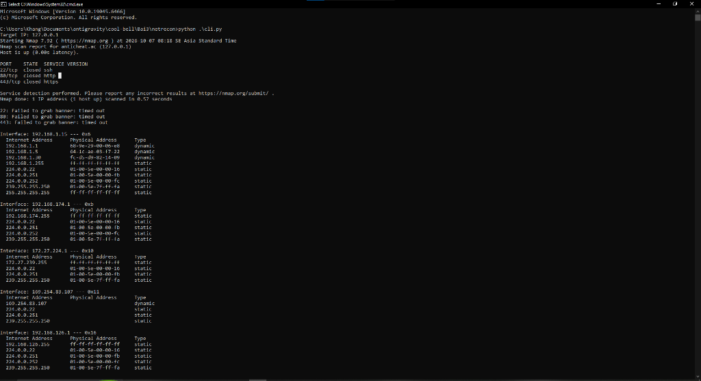
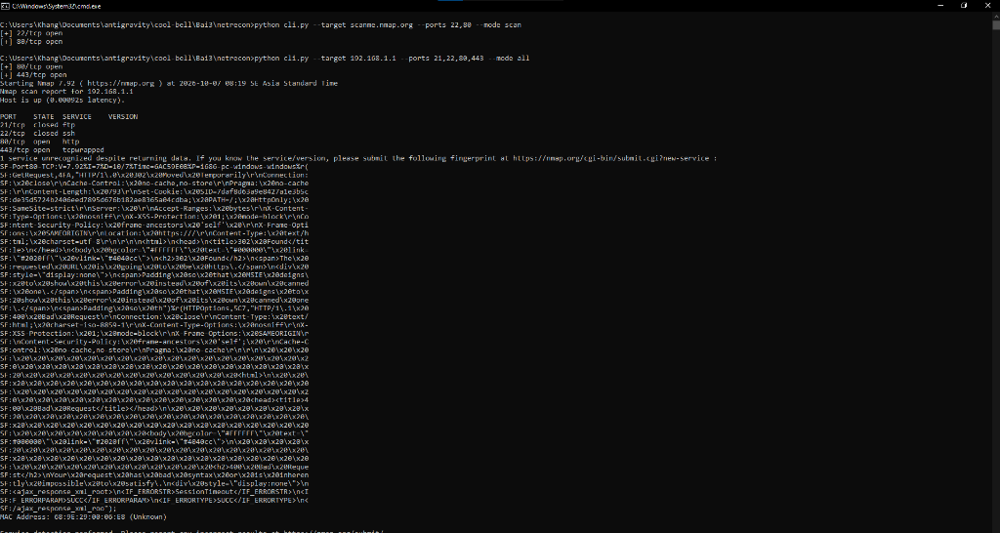
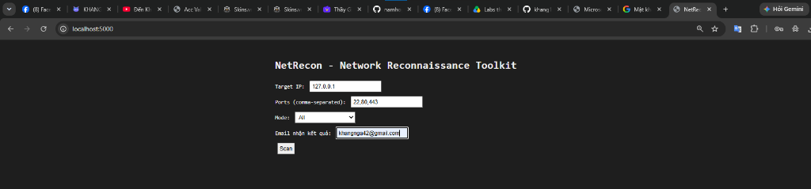
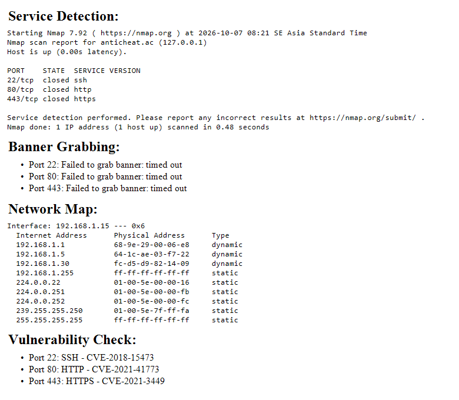
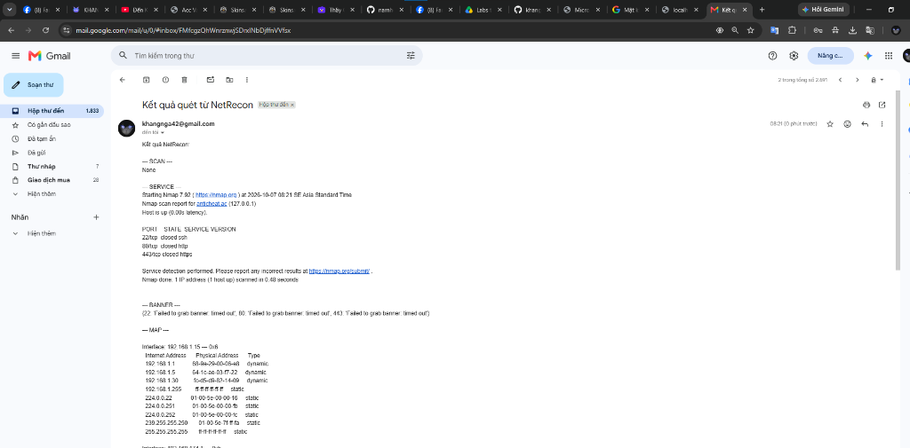

### Họ và Tên: Trần Minh Khang
### MSSV: 2387700027

# BÁO CÁO KỸ THUẬT: NETRECON
## BỘ CÔNG CỤ TRINH SÁT MẠNG, NHẬN DẠNG DỊCH VỤ & KIỂM TRA LỖ HỔNG

---

## 1. Giới thiệu và Kiến trúc Hệ thống `netrecon`

`netrecon` (Network Reconnaissance Toolkit) là bộ công cụ trinh sát và đánh giá an ninh mạng được thiết kế theo kiến trúc module hóa, hỗ trợ cả giao diện dòng lệnh (**CLI**) lẫn giao diện quản trị trên nền Web (**Flask + HTMX**), kèm tính năng tự động gửi báo cáo kết quả qua **Email (SMTP SSL)**.

```text
netrecon/
├── modules/
│   ├── __init__.py                 # Khởi tạo gói module trinh sát
│   ├── port_scanner.py             # Quét cổng TCP bất đồng bộ có giới hạn tốc độ (Rate Limiting)
│   ├── service_detector.py         # Nhận dạng phiên bản dịch vụ chuyên sâu qua Nmap (-sV)
│   ├── banner_grabber.py           # Thu thập chuỗi định danh dịch vụ (Banner Grabbing)
│   ├── network_mapper.py           # Khám phá bảng ánh xạ IP - MAC trong mạng nội bộ (ARP)
│   ├── vuln_checker.py             # Đối chiếu cổng dịch vụ với danh mục lỗ hổng CVE phổ biến
│   ├── filter_utils.py             # Lọc danh sách IP mục tiêu theo Whitelist / Blacklist
│   └── email_sender.py             # Gửi báo cáo kết quả tự động qua máy chủ smtp.gmail.com:465
├── static/
│   └── style.css                   # Định dạng giao diện nền tối (Terminal Dark Theme)
├── templates/
│   ├── layout.html                 # Khung HTML gốc của ứng dụng Web
│   ├── index.html                  # Biểu mẫu nhập thông số quét (Target IP, Ports, Mode, Email)
│   └── result.html                 # Template hiển thị kết quả phân tách theo từng hạng mục
├── cli.py                          # Giao diện dòng lệnh xây dựng trên thư viện Click
├── app.py                          # Máy chủ Web Flask lắng nghe tại cổng 5000
├── requirements.txt                # Các thư viện phụ thuộc (flask, click, asyncio, htmx, python-dotenv)
└── README.md                       # Tài liệu phân tích kỹ thuật chi tiết
```

---

## 2. Phân tích chi tiết các Module Chức năng

### 2.1. Module `port_scanner.py` — Quét cổng bất đồng bộ & Rate Limiting
* Sử dụng `asyncio.open_connection(target, port)` kết hợp `asyncio.wait_for(..., timeout=1)` để kiểm tra trạng thái cổng TCP mà không làm nghẽn luồng chính.
* **Tuân thủ giới hạn tốc độ (Rate Limiting):** Khởi tạo `semaphore = asyncio.Semaphore(rate_limit)` (mặc định `100` tác vụ đồng thời). Cơ chế này ngăn chặn việc mở hàng chục nghìn socket cùng lúc gây cạn kiệt tài nguyên hệ thống hoặc kích hoạt hệ thống phòng vệ IPS/Firewall của mục tiêu.
* Ghi nhật ký chi tiết vào tệp `netrecon.log` kèm dấu thời gian chính xác (`%Y-%m-%d %H:%M:%S`).

### 2.2. Module `service_detector.py` — Nhận dạng dịch vụ chủ động (Active Fingerprinting)
* Tích hợp công cụ chuẩn công nghiệp **Nmap** thông qua lệnh `nmap -sV -p <ports> <ip>`.
* Cờ `-sV` kích hoạt quá trình gửi các gói truy vấn thăm dò (Service Probes) đặc thù cho từng giao thức (HTTP, SSH, FTP, TLS, SMTP...) và phân tích phản hồi để xác định chính xác tên phần mềm và số hiệu phiên bản đang vận hành phía sau cổng mạng.

### 2.3. Module `banner_grabber.py` — Thu thập Banner an toàn
* Thiết lập kết nối TCP socket với ngưỡng thời gian chờ ngắn (`s.settimeout(2)`), đọc tối đa `1024 bytes` đầu tiên do máy chủ phản hồi rồi đóng kết nối ngay lập tức.
* Mọi ngoại lệ mạng (`timeout`, `ConnectionRefusedError`) đều được bắt và xử lý an toàn, đồng thời lưu vết vào `netrecon.log`.

### 2.4. Module `network_mapper.py` & `filter_utils.py` — Khám phá mạng & Kiểm soát phạm vi
* **Khám phá sơ đồ mạng (`map_network`):** Truy vấn bảng phân giải địa chỉ phần cứng ARP (`arp -a`) của hệ điều hành để liệt kê toàn bộ các thiết bị đang hoạt động trên cùng phân đoạn mạng LAN kèm địa chỉ MAC vật lý và loại cấp phát (`dynamic` / `static`).
* **Kiểm soát mục tiêu (`filter_targets`):** Hỗ trợ lọc danh sách địa chỉ IP thông qua tập hợp `whitelist` (chỉ cho phép quét các IP nằm trong danh sách được ủy quyền) và `blacklist` (loại trừ tuyệt đối các máy chủ nhạy cảm không được phép tác động).

### 2.5. Module `vuln_checker.py` & `email_sender.py` — Kiểm tra CVE & Báo cáo tự động
* **Đối chiếu lỗ hổng (`check_vulns`):** Ánh xạ các cổng dịch vụ với các mã lỗ hổng bảo mật nghiêm trọng đã được công bố:
  * **Port 21 (FTP):** `CVE-2015-3306`, `CVE-2001-0261`
  * **Port 22 (SSH):** `CVE-2018-15473`
  * **Port 23 (Telnet):** `CVE-2011-4862`
  * **Port 80 (HTTP):** `CVE-2021-41773` (Apache HTTP Server Path Traversal)
  * **Port 443 (HTTPS):** `CVE-2021-3449` (OpenSSL NULL Pointer Dereference)
* **Gửi báo cáo qua SMTP SSL (`send_email`):** Đọc thông tin xác thực `SMTP_USER` và `SMTP_PASS` (Google App Password) từ tệp môi trường `.env` (được bảo vệ bởi `.gitignore`), thiết lập kênh truyền mã hóa `smtplib.SMTP_SSL('smtp.gmail.com', 465)` và gửi tổng hợp kết quả quét tới địa chỉ email của quản trị viên.

---

## 3. Hướng dẫn Vận hành

### 3.1. Sử dụng Giao diện Dòng lệnh (`cli.py`)
```powershell
# Chạy chế độ tương tác (nhập Target IP từ bàn phím, mặc định quét toàn bộ 'all'):
python .\cli.py

# Quét nhanh cổng mở trên máy chủ thử nghiệm của Nmap:
python cli.py --target scanme.nmap.org --ports 22,80 --mode scan

# Quét toàn diện các cổng 21, 22, 80, 443 trên Gateway nội bộ:
python cli.py --target 192.168.1.1 --ports 21,22,80,443 --mode all
```

### 3.2. Sử dụng Giao diện Web (`app.py`)
```powershell
python .\app.py
```
Mở trình duyệt truy cập `http://localhost:5000/`, nhập thông tin Target IP, danh sách Ports, chọn chế độ Mode và nhập Email nhận báo cáo, sau đó nhấn **Scan**.

---

## 4. Kết quả thực nghiệm (Output Minh chứng)

### 4.1. Kiểm tra `cli.py` trên Terminal
* **Chạy `python .\cli.py` với chế độ mặc định (`all`):**



* **Test nhanh `cli.py` với các tham số dòng lệnh:**



---

### 4.2. Kiểm tra Giao diện Web (`app.py`) và Báo cáo Email
* **Giao diện cấu hình quét tại `http://localhost:5000/`:**



* **Kết quả phản hồi hiển thị trên trình duyệt:**



* **Email thông báo kết quả quét nhận được từ hệ thống:**


