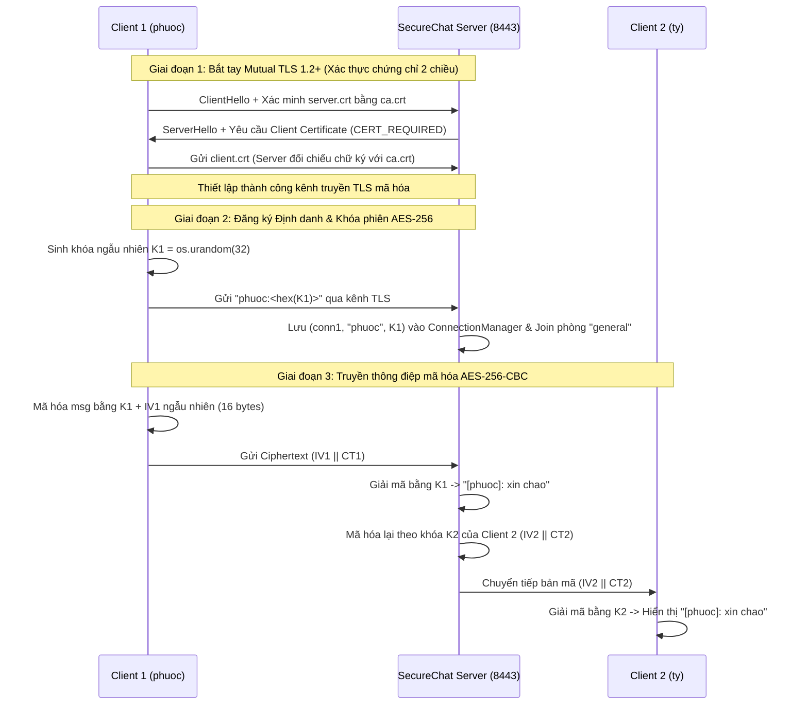
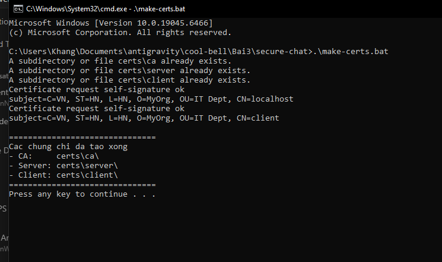
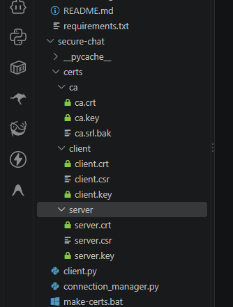
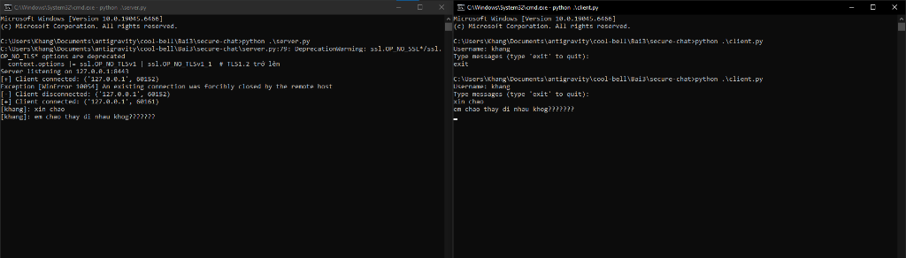
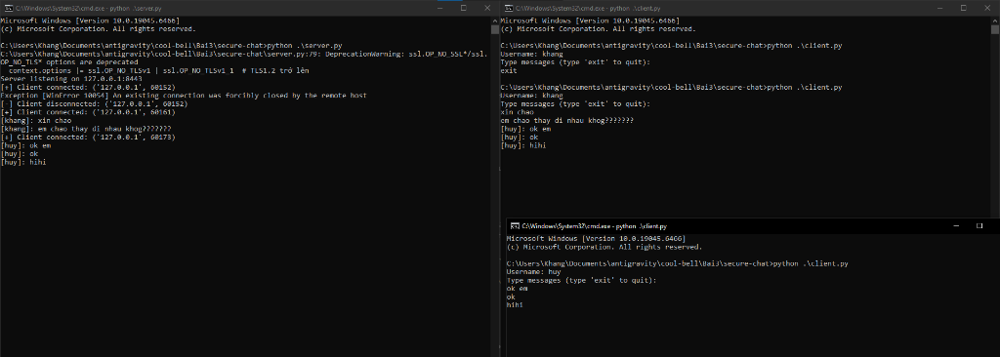

### Họ và Tên: Trần Minh Khang
### MSSV: 2387700027

# BÁO CÁO KỸ THUẬT: SECURECHAT
## LẬP TRÌNH SOCKET AN TOÀN VỚI MUTUAL SSL/TLS & MÃ HÓA AES-256-CBC

---

## 1. Giới thiệu và Kiến trúc Hệ thống `secure-chat`

`secure-chat` là ứng dụng trò chuyện thời gian thực theo mô hình Client-Server đa luồng, áp dụng cơ chế bảo mật kép (Defense-in-Depth): bảo vệ tầng giao vận bằng **Mutual TLS 1.2+** (xác thực chứng chỉ số X.509 hai chiều) và bảo vệ nội dung bản tin bằng thuật toán mã hóa đối xứng **AES-256-CBC**.

```text
secure-chat/
├── certs/                          # Hạ tầng chứng chỉ số X.509 (được tạo bởi make-certs.bat)
│   ├── ca/
│   │   ├── ca.crt                  # Chứng chỉ gốc tự ký (Root CA Certificate)
│   │   ├── ca.key                  # Khóa riêng tư RSA 2048-bit của Root CA
│   │   └── ca.srl.bak              # Tệp lưu số serial cấp phát của CA
│   ├── server/
│   │   ├── server.crt              # Chứng chỉ số của Server do Root CA ký (CN=localhost)
│   │   ├── server.csr              # Yêu cầu ký chứng chỉ (Certificate Signing Request) của Server
│   │   └── server.key              # Khóa riêng tư RSA 2048-bit của Server
│   └── client/
│       ├── client.crt              # Chứng chỉ số của Client do Root CA ký (CN=client)
│       ├── client.csr              # Yêu cầu ký chứng chỉ của Client
│       └── client.key              # Khóa riêng tư RSA 2048-bit của Client
├── openssl.cnf                     # Cấu hình thuộc tính X.509 v3 cho Root CA
├── make-certs.bat                  # Script tự động hóa quy trình cấp phát chứng chỉ
├── message_encryption.py           # Lớp mã hóa và giải mã bản tin AES-256-CBC (PKCS7)
├── connection_manager.py           # Quản lý kết nối socket và khóa AES của từng Client
├── room_manager.py                 # Quản lý danh sách phòng chat và thành viên
├── server.py                       # Máy chủ SecureChat đa luồng (Host: 127.0.0.1, Port: 8443)
├── client.py                       # Máy khách SecureChat tương tác trên dòng lệnh
└── README.md                       # Tài liệu phân tích kỹ thuật chi tiết
```

---

## 2. Sơ đồ Luồng Bắt tay TLS & Trao đổi Tin nhắn Mã hóa



---

## 3. Phân tích chi tiết các Module Mã nguồn

### 3.1. Hạ tầng Chứng chỉ số (`openssl.cnf` & `make-certs.bat`)
* **Root CA (`v3_ca`):** Được cấu hình thuộc tính mở rộng `basicConstraints = critical, CA:true` và `keyUsage = critical, keyCertSign, cRLSign` với thời hạn hiệu lực 3,650 ngày (10 năm).
* **Chứng chỉ Server & Client:** Cả hai thực thể đều sinh cặp khóa RSA 2048-bit riêng biệt, tạo tệp yêu cầu ký `.csr` (`CN=localhost` cho Server và `CN=client` cho Client) và được ký xác nhận bởi khóa riêng của Root CA (`ca.key`) với thuật toán băm `SHA-256`, hiệu lực 365 ngày.

### 3.2. Module `message_encryption.py` — Mã hóa AES-256-CBC
* **Khóa đối xứng 256-bit:** Khởi tạo khóa `os.urandom(32)` (32 bytes = 256 bits).
* **Vector khởi tạo (IV - Initialization Vector):** Mỗi lần gọi hàm `encrypt(plaintext)`, một `iv = os.urandom(16)` mới hoàn toàn được sinh ra và ghép vào đầu bản mã (`return iv + ct`). Nhờ đó, hai tin nhắn có cùng nội dung văn bản sẽ tạo ra hai chuỗi bản mã hoàn toàn khác nhau, chống lại tấn công phân tích mẫu (Pattern Analysis).
* **Đệm khối PKCS7 (`PKCS7(128)`):** Vì chế độ CBC yêu cầu độ dài dữ liệu đầu vào phải là bội số của kích thước khối AES (128 bits = 16 bytes), module sử dụng `padding.PKCS7(128)` để đệm dữ liệu chuẩn xác trước khi mã hóa và gỡ bỏ đệm (`unpadder`) sau khi giải mã.

### 3.3. Module `connection_manager.py` & `room_manager.py` — Quản lý trạng thái Thread-Safe
* Vì Server xử lý mỗi Client trên một luồng (`threading.Thread`) riêng biệt, việc thêm/xóa kết nối hoặc duyệt danh sách Client để gửi tin nhắn có nguy cơ gây xung đột bộ nhớ (`RuntimeError: dictionary changed size during iteration`).
* Cả hai lớp `ConnectionManager` và `RoomManager` đều sử dụng cơ chế khóa đồng bộ `self.lock = threading.Lock()` kết hợp ngữ cảnh `with self.lock:` nhằm đảm bảo tính nguyên tử (Atomicity) cho mọi thao tác đọc/ghi.

### 3.4. Module `server.py` & `client.py` — Cấu hình Bảo mật SSL/TLS
* **Trên Server (`server.py`):**
  * Sử dụng `ssl.create_default_context(ssl.Purpose.CLIENT_AUTH)`.
  * Thiết lập `context.verify_mode = ssl.CERT_REQUIRED`: Bắt buộc mọi Client kết nối đến phải xuất trình chứng chỉ hợp lệ đã được ký bởi `ca.crt`. Nếu kẻ tấn công không có `client.crt` và `client.key`, quá trình bắt tay TLS sẽ bị từ chối ngay lập tức (`ssl.SSLError`).
  * Vô hiệu hóa các giao thức cũ lỗi thời bằng cờ `context.options |= ssl.OP_NO_TLSv1 | ssl.OP_NO_TLSv1_1`, chỉ cho phép kết nối từ **TLS 1.2 trở lên**.
* **Trên Client (`client.py`):**
  * Sử dụng `ssl.create_default_context(ssl.Purpose.SERVER_AUTH, cafile=CA_CERT)` và nạp chứng chỉ cá nhân qua `context.load_cert_chain(certfile=CLIENT_CERT, keyfile=CLIENT_KEY)`.
  * Thiết lập luồng nền (`daemon=True`) chạy hàm `receive_messages` để vừa lắng nghe tin nhắn đến theo thời gian thực vừa cho phép người dùng nhập tin nhắn gửi đi mà không bị chặn (Non-blocking UI).

---

## 4. Kết quả thực nghiệm (Output Minh chứng)

### 4.1. Khởi tạo bộ chứng chỉ số bằng `make-certs.bat`
Lệnh thực thi:
```powershell
.\make-certs.bat
```
Output:
```text
Certificate request self-signature ok
subject=C=VN, ST=HN, L=HN, O=MyOrg, OU=IT Dept, CN=localhost
Certificate request self-signature ok
subject=C=VN, ST=HN, L=HN, O=MyOrg, OU=IT Dept, CN=client

===============================
Cac chung chi da tao xong!
- CA:     certs\ca\
- Server: certs\server\
- Client: certs\client\
===============================
```





---

### 4.2. Kiểm thử kết nối và trao đổi tin nhắn đa luồng
* **Kiểm thử với 1 Client kết nối đến Server:**



* **Kiểm thử với 2 Clients trò chuyện đồng thời:**


